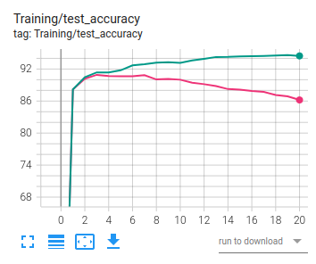
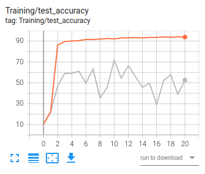
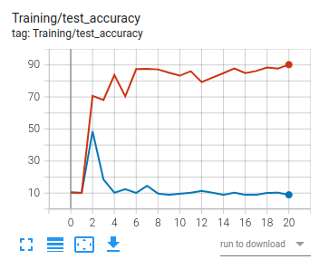
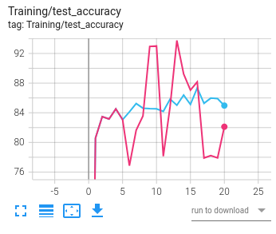
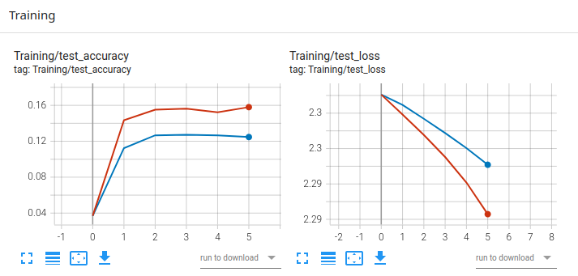

### Note for print statements
In globals_mod, settings.py file has an option to redirect prints to stdout or file. Please choose as required

### Detecting malicious updates with GANs in FL scenarios

* [FL scenarios](scenarios)

```bash
# To run a scenario
bash scenarios/scenario-id.sh
```
***Detection Strategy vs FedAvg: Additive noise attack (for 2 clients)***



***Detection Strategy vs FedAvg: Sign flipping attack (for 2 clients)***



***Detection Strategy vs FedAvg: Same value attack (for 2 clients)***



***Detection Strategy vs FedAvg: Label flipping attack - limited to two labels -> flipping 5 and 8 (for 2 clients)***



* Visualizing training metrics
```bash
tensorboard --logdir ./fl_logs
```



