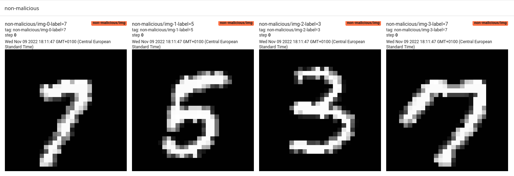
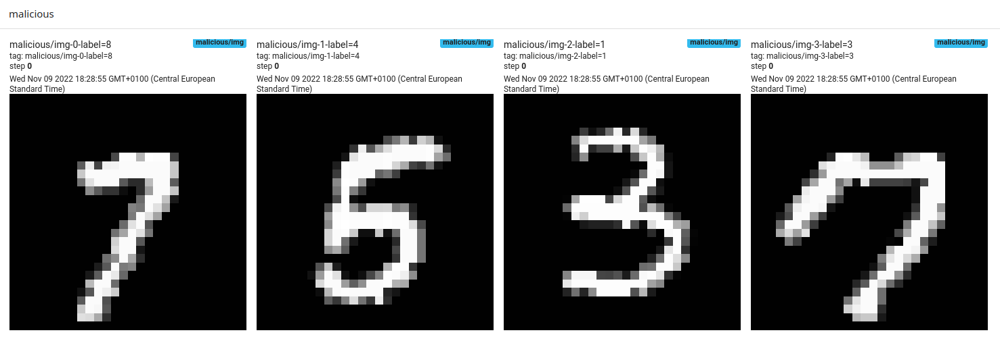

### Detecting malicious updates with GANs in FL scenarios

In this repo, you can find a small FL demo with tensorboard visualization.

run.sh can be used to launch a standard FL scenario (without malicious updates) with 4 clients for 5 rounds. 

run-malicious.sh can be used to launch a FL scenario with 4 clients including a malicious client for 5 rounds.

* Some images and their labels in the standard (non-malicious) scenario


* Some images and their labels in the malicious scenario


* Launching standard FL scenario
```bash
bash run.sh
```

* Launching malicious FL scenario. In this scenario, one client permuted labels of its local images (client number 3).
```bash
bash run-malicious.sh
```

* Visualizing training metrics
```bash
tensorboard --logdir ./fl_logs
```


